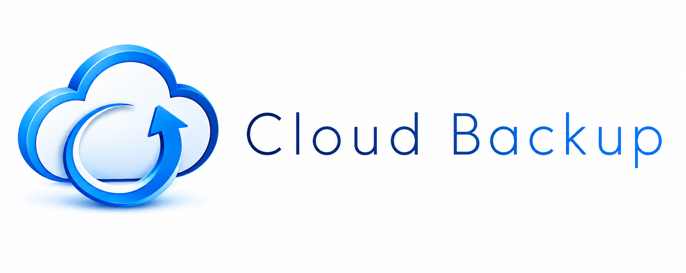
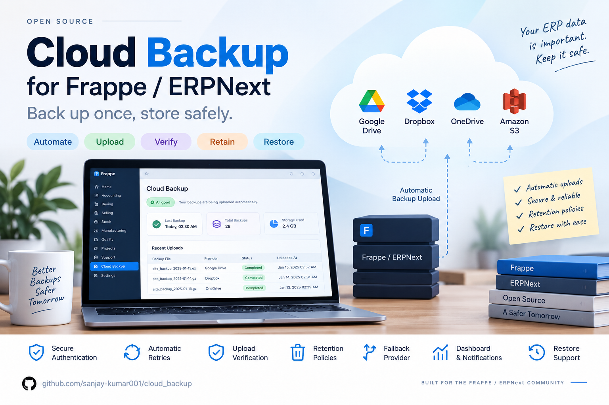
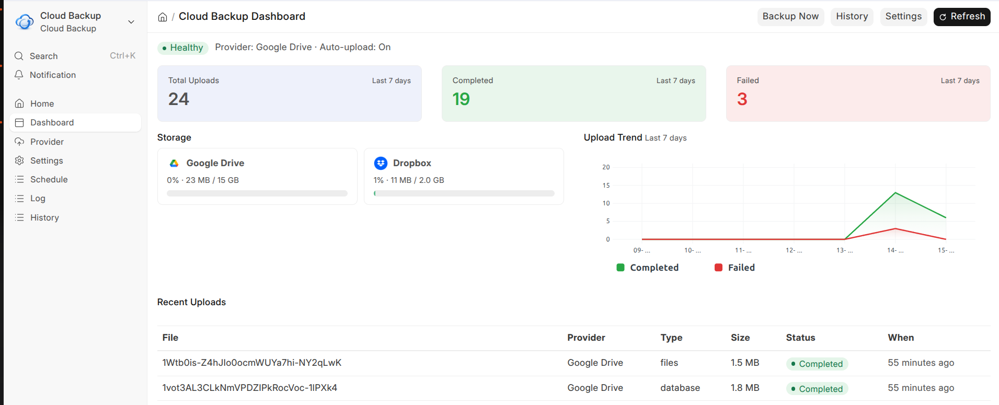

---

# Cloud Backup for Frappe / ERPNext

> Automated, provider‑agnostic backup upload for Frappe / ERPNext.
> Point it at Google Drive, Dropbox, Microsoft OneDrive, or Amazon S3 — Cloud Backup generates your site backups, streams them to cloud storage on a schedule (or right after every `bench backup`), verifies each upload, enforces a retention policy, falls back to a secondary provider, and gives you a live dashboard, notifications, a CLI, and one‑command restore.

[](license.txt)
[](https://www.python.org/downloads/)
[](https://frappeframework.com/)
[](https://erpnext.com/)

---


## Features

### Multi‑Provider Cloud Storage
- **Google Drive**, **Dropbox**, **Microsoft OneDrive** (folder‑based) and **Amazon S3** (object/bucket‑based)
- Built on each vendor's **official SDK** — `google-api-python-client`, `dropbox`, `msal` + Microsoft Graph, and `boto3`
- One frozen provider interface (`CloudBackupProvider`) — adding a new provider means *implementing the interface*, never editing the upload engine
- Per‑provider destination picker: browse and create folders (or S3 prefixes) from the desk

### Secure Authorization
- OAuth 2.0 for Google Drive, Dropbox and OneDrive — tokens are stored **encrypted** and auto‑refreshed
- Access‑key auth for Amazon S3
- A **Test Connection** action validates credentials before you rely on them
- Redirect‑URI helper rendered right on the provider form

### Automatic & Scheduled Uploads
- **Auto‑upload after every backup** — a governed, kill‑switchable hook into `bench backup` uploads the moment a backup finishes
- **Schedules** — Daily, Weekly, or custom cron cadence, each targeting its own provider
- Pick exactly what to ship: **Database**, **Files (public/private)**, or **Full**
- Idempotent enqueue with per‑file dedupe — the same artifact is never uploaded twice

### Reliability
- Background upload jobs on the `long` queue with **exponential‑backoff retry** on transient / rate‑limit errors
- **Multipart / chunked upload** for large files on every provider
- **Upload verification** — remote size + checksum compared against the local artifact
- Every attempt and transition is recorded in **Cloud Backup History**

### Retention & Fallback
- **Retention policy** by **Count** ("keep last N") or **Age** ("keep N days") — deletes *only* files Cloud Backup itself uploaded
- Runs automatically after each upload (scoped to that provider) and daily (all providers) — fully idempotent
- **History housekeeping** purges old, already‑deleted rows after a configurable window
- **Fallback provider** — if the default provider isn't ready, uploads automatically route to your secondary

### Monitoring
- A rich **Cloud Backup Dashboard**: health pill, 7‑day upload summary, per‑provider storage cards with logos and GB progress bars, a 7‑day trend chart, and a recent‑uploads table
- **Quota warnings** — System Managers are notified when a provider nears its storage limit
- **Notifications** on upload failure
- Native **Log Settings** retention for the dedicated Cloud Backup Log

### CLI & Restore
- `bench cloud-backup` — backup + upload, test, list, cleanup, status
- `bench cloud-backup restore <history>` downloads a cloud backup into `private/backups`, ready for `bench restore`



---

## Supported Providers

| Provider | Kind | Auth | SDK | Large files |
| --- | --- | --- | --- | --- |
| Google Drive | Folder | OAuth 2.0 (Google Settings) | `google-api-python-client` | Resumable upload |
| Dropbox | Folder | OAuth 2.0 (app key/secret) | `dropbox` | Upload session |
| Microsoft OneDrive | Folder | OAuth 2.0 (MSAL + Graph) | `msal` + Graph REST | Upload session |
| Amazon S3 | Object | Access key / secret | `boto3` | Managed multipart |

---

## Prerequisites

- Frappe Framework (v16+)
- ERPNext (v16+) — optional, but the app targets a v16 bench
- Python 3.14+
- Redis + a running worker (`bench worker` / `bench start`) for background uploads
- A cloud account for at least one provider (Google, Dropbox, Microsoft, or AWS)

---

## Installation

```bash
# Get the app
bench get-app https://github.com/sanjay-kumar001/cloud_backup

# Install on your site
bench --site <your-site> install-app cloud_backup

# Run migrations
bench --site <your-site> migrate

# Restart so workers pick up the app
bench restart
```

All Python dependencies (`dropbox`, `msal`, `boto3`, …) install automatically with the app.

---

## Configuration

1. Open the **Cloud Backup** workspace from the desk (a desktop icon is installed).
2. Create a **Cloud Backup Provider** at `/app/cloud-backup-provider`, choose the provider type, and:
   - For Google Drive / Dropbox / OneDrive → enter credentials and click **Authorize**.
   - For Amazon S3 → enter the Access Key ID / Secret Access Key, Bucket and Region.
3. Click **Test Connection**, then **Select Destination Folder** (or **Prefix** for S3).
4. Open **Cloud Backup Settings** at `/app/cloud-backup-settings`:
   - Set the **Default Provider** (and optionally a **Fallback Provider**).
   - Tick **Automatic Upload After Backup** and choose the backup types (Database / Files / Full).
   - Optionally enable **Verify Upload**, **Auto‑Delete Remote Backups** (retention), and **Notifications**.
5. (Optional) Add a **Cloud Backup Schedule** for Daily / Weekly / cron uploads.

For a full, step‑by‑step walkthrough — including how to create the OAuth app / IAM keys on each provider — see **[docs/USER_GUIDE.md](docs/USER_GUIDE.md)**.

---

## Usage

Once a provider is authorized and set as default, a normal backup uploads itself:

```bash
bench --site <your-site> backup            # auto-upload fires when it finishes
```

Or drive it directly from the CLI:

| Command | What it does |
| --- | --- |
| `bench cloud-backup` | Create a backup and upload it to the resolved provider (`--with-files` to include files) |
| `bench cloud-backup test` | Test connectivity to the configured provider |
| `bench cloud-backup list --limit 10` | List recent upload history |
| `bench cloud-backup cleanup` | Run the retention policy now |
| `bench cloud-backup status` | Show provider, last‑upload status, and health |
| `bench cloud-backup restore <history>` | Download a cloud backup into `private/backups` for `bench restore` |

From the desk, use the **Cloud Backup Dashboard** for a live view and a **Backup Now** button.

---

## Development

```bash
# Start Frappe (web + workers + scheduler)
bench start

# Linting / formatting
ruff check .
ruff format .

# Or via pre-commit (ruff, eslint, prettier, pyupgrade)
cd apps/cloud_backup && pre-commit install && pre-commit run --all-files
```

**Code conventions**: Python — tabs, 110‑char lines, double quotes, type hints; database access via `frappe.qb` / `frappe.get_all` (no string‑interpolated SQL); typed error family in `cloud_backup.utils.exceptions`.

---

## Documentation

| Document | Description |
| --- | --- |
| [docs/USER_GUIDE.md](docs/USER_GUIDE.md) | End‑to‑end setup — the app, each cloud provider's app / keys, retention, and fallback |
| [docs/PROJECT_OVERVIEW.md](docs/PROJECT_OVERVIEW.md) | High‑level architecture, flows, and design decisions (with diagrams) |
| [docs/PROJECT_STRUCTURE.md](docs/PROJECT_STRUCTURE.md) | File / directory structure, layers, and the provider abstraction (with diagrams) |

---

## 🤝 Contributing

Contributions welcome! Please:
1. Fork the repository
2. Create a feature branch
3. Commit changes (conventional commits: `feat:`, `fix:`, `docs:`, `refactor:`, `test:`)
4. Open a pull request

## 📄 License

MIT License — see `license.txt`.

## 📞 Support

- **Documentation**: see the `docs/` folder
- **Issues**: GitHub Issues
- **Email**: sanjay.kumar001@gmail.com

---

**Built for the Frappe / ERPNext Community by Sanjay Kumar**
