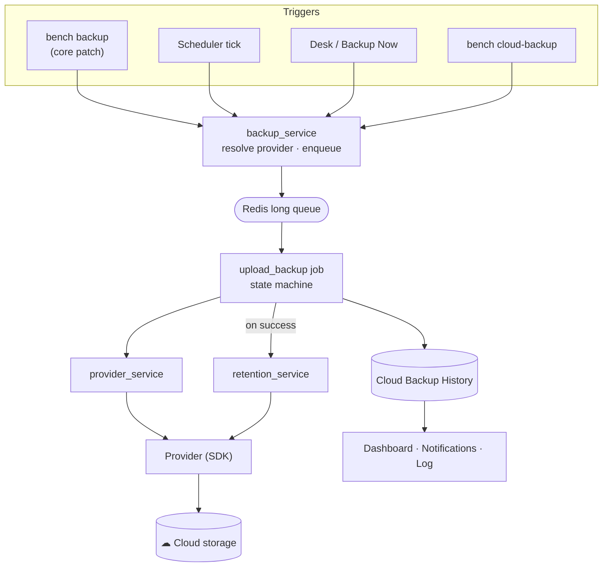
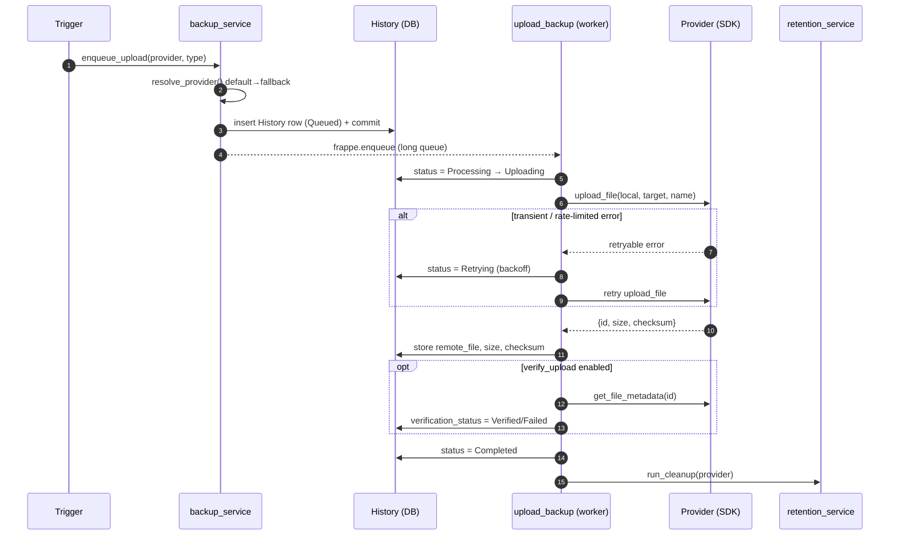
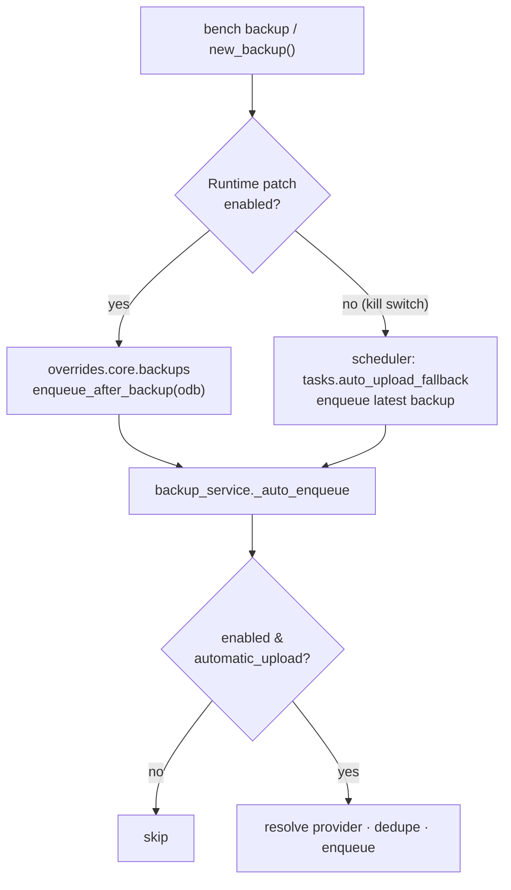
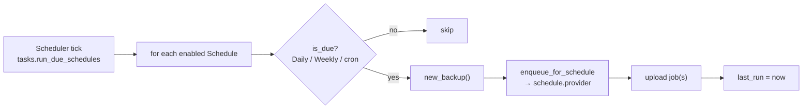
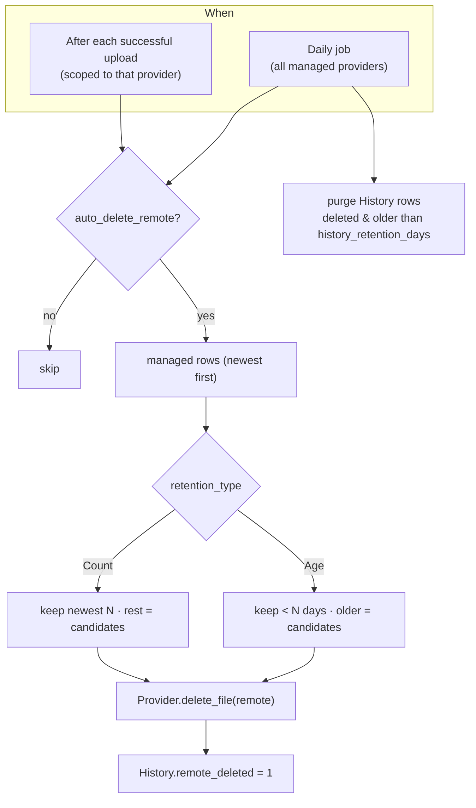
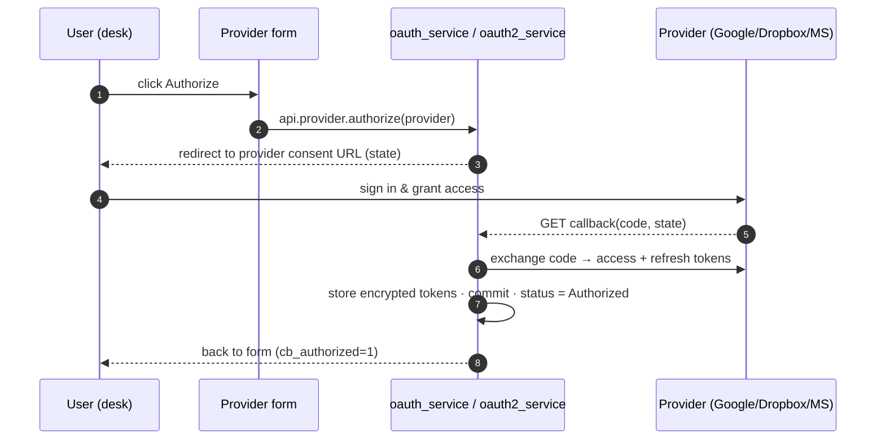

# Cloud Backup — Project Overview

A high‑level tour of what Cloud Backup does, how its pieces fit together, and the key design decisions —
with diagrams for the main flows.

---

## Index

1. [What it is](#1-what-it-is)
2. [Capabilities at a glance](#2-capabilities-at-a-glance)
3. [System architecture](#3-system-architecture)
4. [End‑to‑end upload flow](#4-endtoend-upload-flow)
5. [Auto‑upload triggers](#5-autoupload-triggers)
6. [Scheduled backups](#6-scheduled-backups)
7. [Retention flow](#7-retention-flow)
8. [OAuth authorization flow](#8-oauth-authorization-flow)
9. [Provider abstraction & storage kinds](#9-provider-abstraction--storage-kinds)
10. [The one governed core patch](#10-the-one-governed-core-patch)
11. [Security model](#11-security-model)
12. [Design decisions](#12-design-decisions)

---

## 1. What it is

Cloud Backup automates the journey of a Frappe/ERPNext site backup from the local `private/backups`
directory to durable cloud storage. It generates backups, uploads them to **Google Drive, Dropbox,
Microsoft OneDrive, or Amazon S3**, verifies each upload, keeps a policy‑bound number of copies, and gives
operators a dashboard, notifications, a CLI, and one‑command restore.

Its central design goal is a **frozen provider abstraction**: the upload/retention engine is written once
against an interface, and every provider — folder‑based or object‑based — plugs in behind it without the
engine changing.

---

## 2. Capabilities at a glance

| Area | What you get |
| --- | --- |
| **Providers** | Google Drive · Dropbox · OneDrive (folder) · Amazon S3 (object), each on its official SDK |
| **Triggers** | After every `bench backup` (auto), on a schedule (Daily/Weekly/cron), or on demand (desk/CLI) |
| **Artifacts** | Database · Files (public/private) · Full |
| **Reliability** | Background jobs, exponential‑backoff retry, multipart upload, size+checksum verification |
| **Lifecycle** | Retention by count or age, history housekeeping, per‑provider + daily passes |
| **Resilience** | Default → fallback provider resolution |
| **Visibility** | Dashboard, quota warnings, failure notifications, dedicated log, full history |
| **Ops** | `bench cloud-backup` CLI, restore‑to‑`private/backups` |

---

## 3. System architecture

The **entry points are many, the engine is one.** Every trigger funnels into `backup_service`, which
resolves the provider and enqueues a job; the job is the single place where an upload actually happens.

---

## 4. End‑to‑end upload flow

Each transition is persisted, so History is a faithful audit trail even if a worker dies mid‑upload.

---

## 5. Auto‑upload triggers

Auto‑upload has a **primary path** (a governed patch that fires the instant a backup finishes) and a
**fallback path** (a scheduler poller) so it keeps working even when the patch is disabled.

Deduplication (`already_uploaded`) guarantees the two paths never double‑upload the same artifact.

---

## 6. Scheduled backups

Schedules always target **their own** provider; the default/fallback logic applies only to auto‑upload and
the CLI.

---

## 7. Retention flow

Retention only ever deletes files recorded in History as uploaded by Cloud Backup — never anything else in
your storage — and is **idempotent**.

---

## 8. OAuth authorization flow

Applies to Google Drive, Dropbox and OneDrive. Amazon S3 uses static access keys and skips this entirely.

> The callback is a **GET** request, which Frappe does not auto‑commit — the services commit the stored
> tokens explicitly, otherwise the authorization would silently roll back.

---

## 9. Provider abstraction & storage kinds

All providers implement one interface (`CloudBackupProvider`) with methods for connect/test, folder
browse/create, upload (with multipart), list/metadata/delete/download, and storage usage. Two **storage
kinds** capture the only real structural difference:

| Kind | Providers | "Folder" is… | "File id" is… |
| --- | --- | --- | --- |
| **Folder** | Google Drive, Dropbox, OneDrive | a real folder | a folder/file id or path |
| **Object** | Amazon S3 | a key **prefix** | the object **key** |

The desk form adapts to the kind (folder browser vs. prefix browser; Authorize vs. keys), and the engine
treats both identically through the interface.

---

## 10. The one governed core patch

Cloud Backup needs Frappe to notify it when a backup finishes. Rather than forking core, it applies a
single, **governed** runtime patch to `new_backup`:

- **Idempotent** — applied once per process, original retained for rollback.
- **Kill‑switchable** — `disable_runtime_patches` in `site_config.json` turns it off instantly.
- **Self‑healing** — when disabled, `tasks.auto_upload_fallback` (a scheduler job) sustains auto‑upload by
  polling for the latest backup.

This keeps the integration minimal, reversible, and safe to ship.

---

## 11. Security model

- **Credentials are encrypted at rest** — client secrets and OAuth tokens are stored in `Password` fields
  (Frappe's encrypted store), never in plaintext or logs.
- **Least privilege** — request only the scopes/permissions needed (`drive.file`, `Files.ReadWrite.All`,
  scoped S3 IAM policy).
- **Redirect‑URI discipline** — the exact callback URI is shown on the form and must be registered in the
  provider console; mismatches are the top failure mode and are rejected by the provider.
- **Permission‑gated endpoints** — every whitelisted API checks `frappe.has_permission` on the relevant
  DocType.
- **Auto‑refresh** — expired access tokens are refreshed from the stored refresh token; no manual
  re‑authorization for routine expiry.

---

## 12. Design decisions

| Decision | Rationale |
| --- | --- |
| **Frozen provider interface** | Adding a provider = implement the interface; the engine never changes (proven by S3, an object store, dropping into a folder‑oriented engine unchanged). |
| **Official vendor SDKs** | Correct auth, refresh, retry and multipart behaviour without re‑implementing protocols. |
| **Background jobs on the `long` queue** | Uploads can be large/slow; the web request returns immediately and the worker owns retries. |
| **Everything funnels through `backup_service`** | One enqueue path → one dedupe guard → one provider‑resolution rule. |
| **Retention deletes only managed files** | The app is a good tenant of your storage; it never removes files it didn't create. |
| **Default → fallback resolution** | A broken primary diverts new backups instead of failing. |
| **One governed, kill‑switchable patch** | Minimal, reversible core integration with a scheduler fallback. |
| **Dashboard loads asynchronously** | Fast local data paints immediately; slow remote quota calls stream in separately. |
