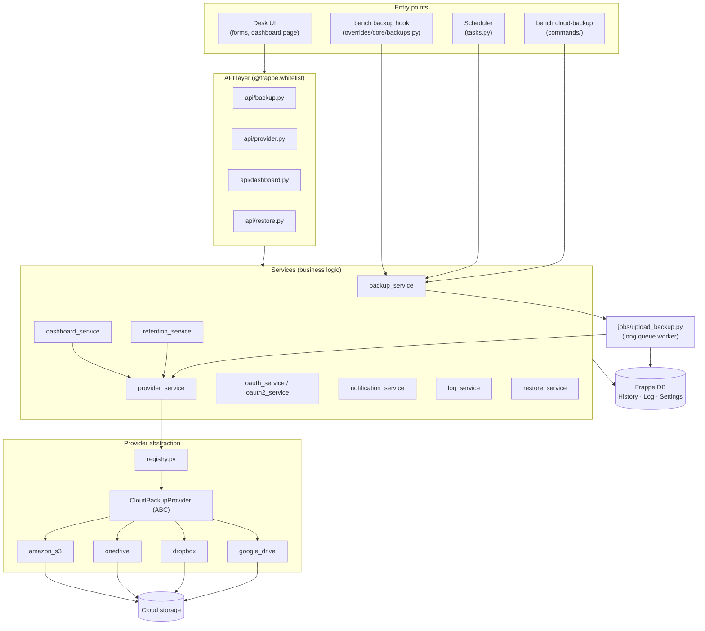
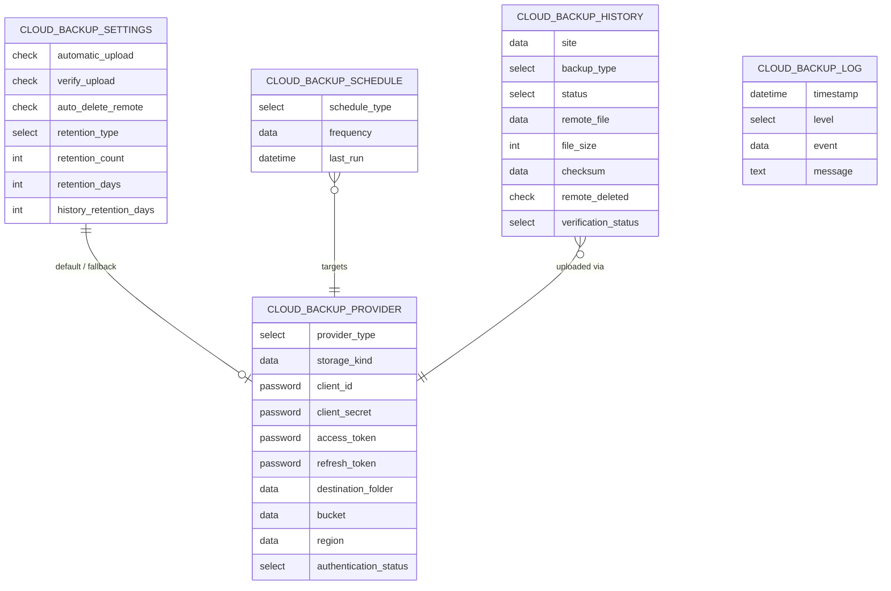
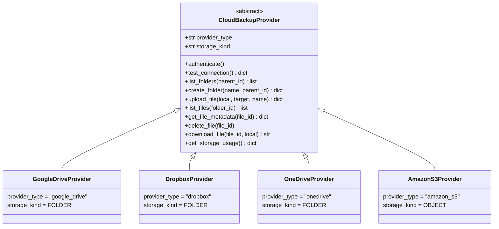
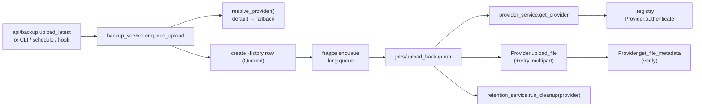

# Cloud Backup — Project Structure

**Authority:** This is the living file‑layout reference. It wins file‑layout conflicts once populated.
Update it in the same commit whenever DocTypes or packages are added or renamed.

---

## Index

1. [Layered architecture](#1-layered-architecture)
2. [Directory layout](#2-directory-layout)
3. [Module responsibilities](#3-module-responsibilities)
   - [3.1 API layer](#31-api-layer-cloud_backupapi)
   - [3.2 Services](#32-services-cloud_backupservices)
   - [3.3 Providers](#33-providers-cloud_backupproviders)
   - [3.4 Jobs](#34-jobs-cloud_backupjobs)
   - [3.5 Overrides (core patch)](#35-overrides-cloud_backupoverrides)
   - [3.6 Utils](#36-utils-cloud_backuputils)
4. [DocTypes (data model)](#4-doctypes-data-model)
5. [Provider abstraction](#5-provider-abstraction)
6. [Request → upload call graph](#6-request--upload-call-graph)
7. [Conventions](#7-conventions)

---

## 1. Layered architecture

Cloud Backup is a layered Frappe app. UI and CLI enter through thin **API / command** shells; all logic
lives in **services**; storage I/O is isolated behind the **provider abstraction**; the actual upload runs
in a background **job**.



---

## 2. Directory layout

DocType controllers live in the module directory (`cloud_backup/cloud_backup/doctype/…`, standard Frappe).
Supporting Python packages sit at the app‑root package (`cloud_backup/<pkg>/`) and are imported by dotted
path.

```
cloud_backup/                                  # Python package (Frappe backend)
│
├── api/                                       # @frappe.whitelist() endpoints (thin)
│   ├── backup.py                              # upload_latest / enqueue
│   ├── provider.py                            # authorize · test · list/create folders
│   ├── dashboard.py                           # get_overview (fast) · get_storage (async)
│   └── restore.py                             # download a stored backup
│
├── services/                                  # Business logic (no HTTP concerns)
│   ├── backup_service.py                      # discover backups, enqueue, provider resolve/fallback
│   ├── provider_service.py                    # build config + authenticated provider instance
│   ├── retention_service.py                   # settings-gated cloud retention + history purge
│   ├── dashboard_service.py                   # health, summary, storage, recent, trend
│   ├── oauth_service.py                        # Google Drive OAuth (Frappe GoogleOAuth)
│   ├── oauth2_service.py                       # Dropbox + OneDrive OAuth2 (SDK/MSAL)
│   ├── notification_service.py                # System Manager notifications
│   ├── log_service.py                          # dedicated Cloud Backup Log writer
│   └── restore_service.py                     # download remote → private/backups
│
├── providers/                                 # Storage abstraction + concrete providers
│   ├── base.py                                # CloudBackupProvider ABC (frozen contract)
│   ├── registry.py                            # provider_type → class map
│   ├── errors.py
│   ├── google_drive/provider.py               # google-api-python-client
│   ├── dropbox/provider.py                    # official dropbox SDK
│   ├── onedrive/provider.py                   # MSAL + Microsoft Graph REST
│   └── amazon_s3/provider.py                  # boto3 (object store)
│
├── jobs/                                       # Background workers
│   ├── upload_backup.py                       # the upload state machine (retry/verify)
│   └── cleanup_backup.py                      # daily retention entry
│
├── overrides/                                 # Governed core patch (one)
│   ├── patch_manager.py                       # kill-switchable, idempotent applier
│   ├── patch_registry.py                      # registered patch list
│   └── core/backups.py                        # new_backup hook → auto-upload
│
├── commands/__init__.py                       # bench cloud-backup CLI group
├── tasks.py                                   # scheduler entrypoints
├── hooks.py                                   # app hooks (scheduler, patches, log retention)
├── utils/
│   ├── constants.py                           # queues, chunk size, StorageKind, quota threshold
│   ├── exceptions.py                          # typed error taxonomy
│   └── file_utils.py                          # remote filename builder
│
├── cloud_backup/                              # Frappe module (metadata + desk artifacts)
│   ├── doctype/
│   │   ├── cloud_backup_settings/             # Single — global config
│   │   ├── cloud_backup_provider/             # Per-provider credentials + destination
│   │   ├── cloud_backup_schedule/             # Time-based upload cadence
│   │   ├── cloud_backup_history/             # One row per upload attempt
│   │   └── cloud_backup_log/                  # Dedicated event log (retention via Log Settings)
│   ├── page/cloud_backup_dashboard/           # The rich dashboard page (JS)
│   ├── number_card/                           # Uploads / Completed / Failed cards
│   └── workspace/cloud_backup/                # Desk workspace
│
├── desktop_icon/                              # Desk home icon
├── workspace_sidebar/                         # Sidebar navigation
├── public/images/                             # Provider logos, app logo
└── tests/                                     # Unit tests (providers, dashboard, registry)
```

---

## 3. Module responsibilities

### 3.1 API layer (`cloud_backup/api/`)

Thin `@frappe.whitelist()` wrappers — permission check, delegate to a service, shape the response. No
business logic. `dashboard.py` is deliberately split: `get_overview()` returns fast local data;
`get_storage()` performs the slower remote quota calls so the page loads asynchronously.

### 3.2 Services (`cloud_backup/services/`)

| Service | Responsibility |
| --- | --- |
| `backup_service` | Find latest backups, create History rows, enqueue uploads, resolve default→fallback provider, dedupe. |
| `provider_service` | Assemble the credential/destination config and return an **authenticated** provider instance (refreshing OAuth tokens when stale). |
| `retention_service` | Apply the count/age policy to managed remote files; purge old deleted History rows. Idempotent. |
| `dashboard_service` | Compute health, 7‑day summary, per‑provider storage (with logo), recent uploads, and 7‑day trend. |
| `oauth_service` | Google Drive OAuth via Frappe's `GoogleOAuth("drive")`. |
| `oauth2_service` | Dropbox (`DropboxOAuth2Flow`) and OneDrive (MSAL) OAuth2, shared callback, state encoding. |
| `notification_service` | Notify System Managers (failures, quota). |
| `log_service` | Write structured rows to Cloud Backup Log. |
| `restore_service` | Download a remote backup into `private/backups`. |

### 3.3 Providers (`cloud_backup/providers/`)

Each concrete provider subclasses `CloudBackupProvider` and implements the same methods on its vendor SDK.
The `registry.py` maps `provider_type` → class; the upload engine only ever talks to the ABC.

### 3.4 Jobs (`cloud_backup/jobs/`)

`upload_backup.run()` is the upload **state machine**: `Processing → Uploading → (Retrying) → Verifying →
Completed`/`Failed`, persisting each transition and triggering per‑provider retention on success.
`cleanup_backup.run()` is the daily retention entry.

### 3.5 Overrides (`cloud_backup/overrides/`)

The app applies **exactly one** governed runtime patch — wrapping Frappe's `new_backup` so a finished
`bench backup` triggers auto‑upload. It is **idempotent** and gated by a **kill switch**
(`disable_runtime_patches` in site config); when disabled, a scheduler fallback poller sustains
auto‑upload instead.

### 3.6 Utils (`cloud_backup/utils/`)

`constants.py` holds non‑schema constants (queue name, chunk size, `StorageKind`, quota threshold and the
`PROVIDER_STORAGE_KIND` map). `exceptions.py` is the typed error taxonomy that classifies retryability.

---

## 4. DocTypes (data model)



| DocType | Kind | Purpose |
| --- | --- | --- |
| **Cloud Backup Settings** | Single | Global switches: default/fallback provider, auto‑upload, backup types, verification, retention, notifications, last‑run status. |
| **Cloud Backup Provider** | Standard | One record per provider: type, encrypted credentials, destination folder/prefix or bucket/region, auth status. |
| **Cloud Backup Schedule** | Standard | Time‑based upload cadence (Daily/Weekly/cron) bound to a provider. |
| **Cloud Backup History** | Standard | One row per upload attempt — status, remote id, size, checksum, verification, retry count, error. |
| **Cloud Backup Log** | Standard | Dedicated event log; retention managed by native **Log Settings**. |

---

## 5. Provider abstraction

Every provider implements the same frozen interface; storage semantics (folder vs. object) are declared on
the class and derived into a registry map.



> **Extension rule:** adding a provider = create `providers/<name>/provider.py`, subclass the ABC, declare
> `provider_type` + `storage_kind`, and register it. The upload/retention engine is never edited — a guard
> test keeps `PROVIDER_STORAGE_KIND` in sync with the registered classes.

---

## 6. Request → upload call graph



---

## 7. Conventions

- **Python:** ruff — tabs, 110‑char lines, double quotes, `target py314`.
- **Queries:** `frappe.qb` for non‑trivial queries; `frappe.get_all` / `get_list` for single‑table reads;
  no string‑interpolated SQL.
- **Errors:** raise from `cloud_backup.utils.exceptions`; providers map SDK failures onto that taxonomy so
  the engine can classify retryability uniformly.
- **Naming:** standard Frappe conventions; no invented concept‑words as identifiers.
- **Standard records** (workspace, number cards, page, desktop icon, sidebar) ship as JSON under the module
  and are synced by `bench migrate`.
